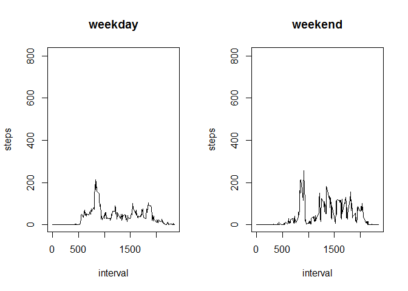

# Reproducible Research: Peer Assessment 1


## Loading and preprocessing the data

```r
unzip("activity.zip")
activity<-read.csv(".\\activity.csv")
```


## What is mean total number of steps taken per day?

```r
sums <- aggregate(steps ~ date, data=activity, sum)
hist(sums$steps,xlab="steps",main="The Total Number of Steps Taken Each Day")
```

 


```r
stepmean<-mean(sums$steps)
stepmedian<-median(sums$steps)
```
The mean is 1.0766189\times 10^{4} and median is 10765 of total number of steps taken per day .

## What is the average daily activity pattern?

```r
aves<-aggregate(steps~interval,data=activity,mean)
plot(aves$interval,aves$steps,type="n",xlab="interval",ylab="steps",
     main="The Average Number of Steps versus 5-minute Intervals")
lines(aves$interval,aves$steps)
```

 


```r
maxaveinterval<-aves[aves$steps==max(aves$steps),1]
```

The 835th interval, on average across all the days in the dataset, contains the maximum number of steps.

## Imputing missing values

Calculate and report the total number of missing values in the dataset:

```r
missvnum<-sum(is.na(activity$steps))
```
The total number of rows with NAs is 2304.

Using  the mean for that 5-minute interval filling in all of the missing values in the dataset:

```r
imputvalue<-function(inter){
        aves[aves$interval==inter,2]
        }
```

Create a new dataset that is equal to the original dataset but with the missing data filled in:

```r
imputacty<-activity
for (i in 1:17568){
        if (is.na(imputacty[i,1])){
                imputacty[i,1]=imputvalue(imputacty[i,3])
        }
}
```
Make a histogram of the total number of steps taken each day and Calculate and report the mean and median total number of steps taken per day. Do these values differ from the estimates from the first part of the assignment? What is the impact of imputing missing data on the estimates of the total daily number of steps?

```r
imputsums <- aggregate(steps ~ date, data=imputacty, sum)
hist(imputsums$steps,xlab="steps",main="The Total Number of Steps Taken Each Day")
```

 


```r
imputstepmean<-mean(imputsums$steps)
imputstepmedian<-median(imputsums$steps)
```
The mean is 1.0766189\times 10^{4} and median is 1.0766189\times 10^{4} total number of steps taken per day .

Are there differences in activity patterns between weekdays and weekends?

Create a new factor variable in the dataset with two levels – “weekday” and “weekend” indicating whether a given date is a weekday or weekend day.

```r
wekdy<-function(dt){
        wk<-weekdays(as.Date(dt))
        if((wk=="星期六")){
                wk<-"weekend"
                wk
        }
        else{
                wk<-"weekday"
                wk
        }
}

weekd<-vector()
for (i in 1:17568){
        temp<-wekdy(imputacty[i,2])
        weekd<-rbind(weekd,temp) 
}
imputactyadd1<-cbind(imputacty,factor(weekd))
names(imputactyadd1)[4]<-"weekd"
```

Make a panel plot containing a time series plot of the 5-minute interval and the average number of steps taken, averaged across all weekday days or weekend days. 

```r
par(mfcol=c(1,2))
plot(imputactyadd1$interval,imputactyadd1$steps,type="n",xlab="interval",ylab="steps",main="weekday")

imputweekday<-imputactyadd1[imputactyadd1$weekd=="weekday",]
avesweekday<-aggregate(steps~interval,data=imputweekday,mean)
lines(avesweekday$interval,avesweekday$steps)

plot(imputactyadd1$interval,imputactyadd1$steps,type="n",xlab="interval",ylab="steps",
     main="weekend")
imputweekend<-imputactyadd1[imputactyadd1$weekd=="weekend",]
avesweekend<-aggregate(steps~interval,data=imputweekend,mean)
lines(avesweekend$interval,avesweekend$steps)
```

 
